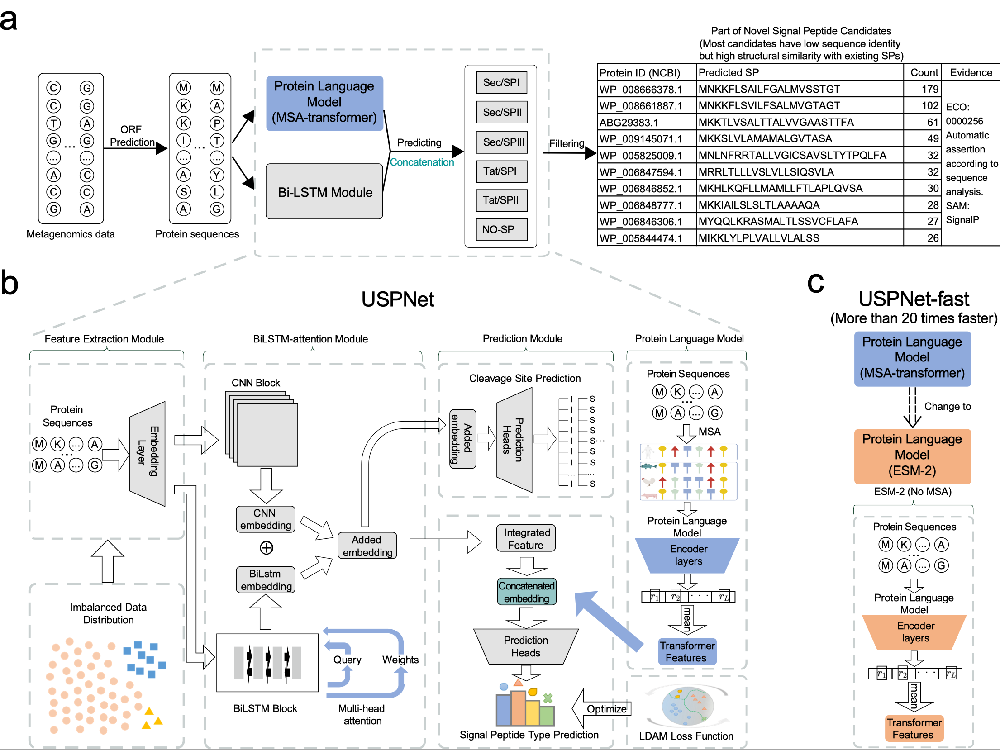

# USPNet

Update-March 2024: We provide a [Demo](https://www.kaggle.com/code/qinzeyu/uspnet-example) for using USPNet-fast, which takes raw amino acid sequences as input. [Tutorial video (in Chinese)](https://www.bilibili.com/video/BV1yK421h7Rm/?vd_source=a80c1513b9533b969f95a485ab252511)<br>

This repository contains code for the paper ***Unbiased organism-agnostic and highly sensitive signal peptide predictor with deep protein language model***, which is accepted by *Nature Computational Science*.



The full text of the paper can also be accessed via the [view-only link](https://rdcu.be/dtupB).

You can use either USPNet or USPNet-fast to predict the signal peptide of a protein sequence.<br>


## Local Environment Setup for running the test

First, download the repository and create the environment.<br>

### Create an environment with conda
requirement
```bash
git clone https://github.com/ml4bio/USPNet.git
cd ./USPNet
conda env create -f ./environment.yml
```

### Download the benchmark set
[Test set](https://drive.google.com/file/d/1O-Uwo2HOk5H2IiyPHCqWiBCNX6MbPf4U/view?usp=sharing).<br>

### Download categorical benchmark data
[Categorical test data](https://drive.google.com/file/d/1r9sw5t3BVzYsw4RZG48N-7Y621pQFHJK/view?usp=sharing).<br>

### Download embeddings for the benchmark set
[MSA embedding for test set](https://drive.google.com/file/d/1FPPKO9OaAdB0K9heUqQuymmqMN4m_XI3/view?usp=sharing).<br>

### All the data mentioned above can also be obtained from our [OSF project](https://osf.io/nh3cf/).<br>

### Download trained predictive models
[USPNet prediction head](https://drive.google.com/file/d/1ZNDZ_ulmeZzol7u1_fMEODe7nvtWLFqh/view?usp=sharing)

[USPNet prediction head (without organism group information)](https://drive.google.com/file/d/1YfFmGZNEhl4q86dljPeWub1WLLCH7VNx/view?usp=drive_link).

[USPNet-fast prediction head](https://drive.google.com/file/d/1eQMBVPvu3Nd7zEgLGinY09GUXbhn_LOy/view?usp=drive_link).

[USPNet-fast prediction head (without organism group information)](https://drive.google.com/file/d/1wVzjoZC_v1-1SwhTwB06pqWoKYMx1yu8/view?usp=drive_link).<br>

### Trained predictive model targeting the major class (Sec/SPI)
Specialized trained model optimized with higher accuracy on the major class (Sec/SPI). The model emphasizes the major class through an increased weight on the major class (Sec/SPI) in the objective function.

[USPNet-fast prediction head (focus on Sec/SPI, require group information)](https://drive.google.com/file/d/1uwT9fL8TWwh8kXVs1IwdBTtMLALB9EJ7/view?usp=drive_link).<br>

## Usage
Put all the downloaded files into the same folder.<br>

If you want to use USPNet on our benchmark set, please run:
```bash
# data processing, data_processed/ folder is created by default
python data_processing.py 
#Please put MSA embedding into the data_processed/ folder
python predict.py

# categorical benchmark data
unzip test_data.zip
python test.py
```

Demo of USPNet on benchmark data without organism group information:
```bash
python predict.py --group_info no_group_info

python test.py no_group_info
```

Demo of USPNet-fast on benchmark data:
```bash
python predict_fast.py

python test_fast.py
```

Demo of USPNet on benchmark data without organism group information:
```bash
python predict.py --group_info no_group_info

python test_fast.py no_group_info
```

To generate MSA embeddings on your own protein sequences and use USPNet to perform signal peptide prediction, please run:
```bash
# MSA embedding generation. <data_directory_path>: Directory where the processed data will be saved. <msa_directory_path>: Directory for storing MSA files (.a3m).
python data_processing.py --fasta_file <fasta_file_path> --data_processed_dir <data_directory_path> --msa_dir <msa_directory_path>

# Prediction. use 'python predict.py --data_dir <data_directory_path> --group_info no_group_info' if lack of organism group information.
python predict.py --data_dir <data_directory_path>
```

If you want to use USPNet-fast to perform signal peptide prediction on your own protein sequences, please run:
```bash
# Data processing. Processed data is saved in data_processed/ by default.
python data_processing.py --fasta_file <fasta_file_path> --data_processed_dir <data_directory_path>

# Prediction. use 'python predict_fast.py --data_dir <data_directory_path> --group_info no_group_info' if lack of organism group information.
python predict_fast.py --data_dir <data_directory_path>

```

## Citations <a name="citations"></a>

If you find the models useful in your research, please kindly cite our paper:

```bibtex
@article{shen2024unbiased,
  title={Unbiased organism-agnostic and highly sensitive signal peptide predictor with deep protein language model},
  author={Shen, Junbo and Yu, Qinze and Chen, Shenyang and Tan, Qingxiong and Li, Jingchen and Li, Yu},
  journal={Nature Computational Science},
  volume={4},
  number={1},
  pages={29--42},
  year={2024},
  publisher={Nature Publishing Group US New York}
}
```
